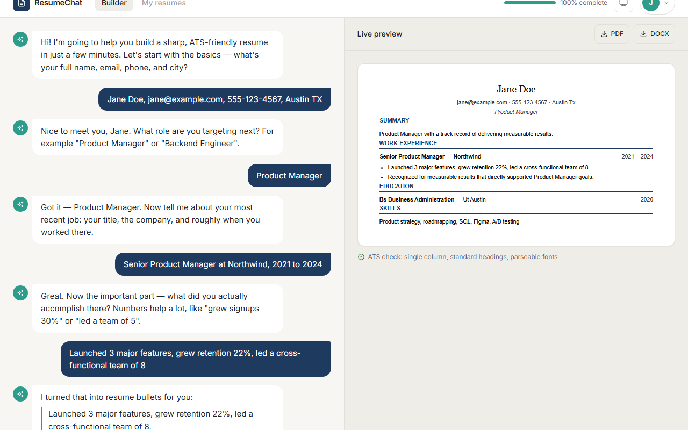
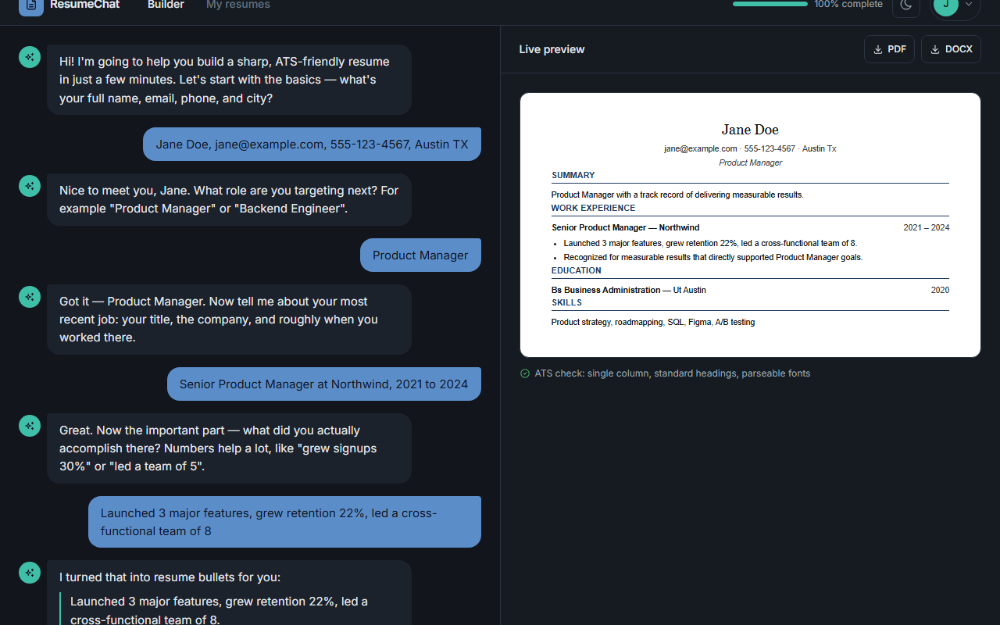
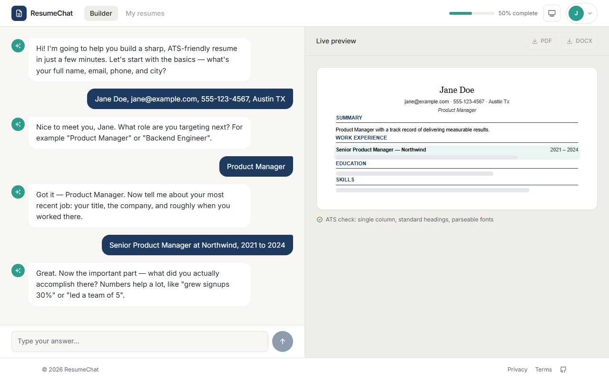
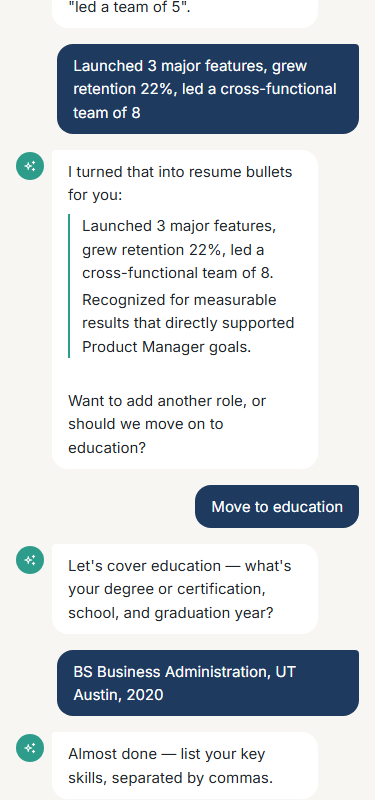
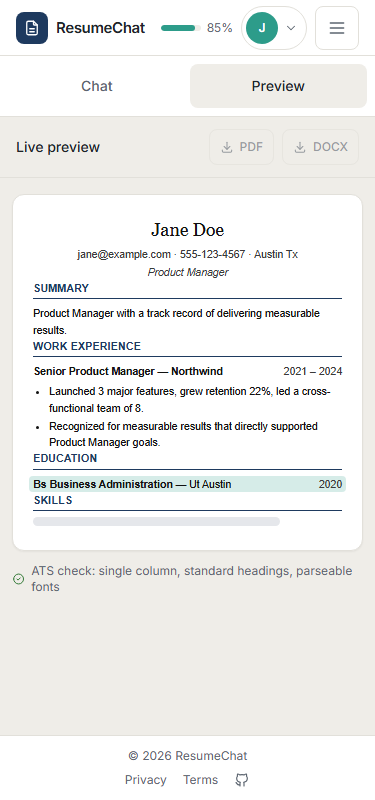

# ResumeChat — AI resume builder

ResumeChat turns building a resume into a conversation. No forms, no blank-page anxiety — you
chat with an AI about your background, it rewrites your rough answers into sharp, quantified,
ATS-friendly bullets, and a live document preview fills in on the right as you talk. When you're
done, download a real PDF or DOCX.

<table>
<tr>
<td></td>
<td></td>
</tr>
</table>

## Features

**Conversational interview, not a form.** The AI asks for contact info, target role, experience,
education, and skills one step at a time, and turns rough descriptions into quantified bullets
("grew retention 22%, led a cross-functional team of 8") automatically.

**Live preview with a signature moment.** Every time the AI updates the resume, the changed
section flashes a soft accent tint in the preview so you always know exactly what just changed —
this is the product's memorable interaction, and it respects `prefers-reduced-motion`.



**Real file downloads.** PDF and DOCX are generated client-side and match the on-screen preview
pixel-for-pixel in structure — no waiting on a server render.


**A real mobile experience**, not just "doesn't break." Below 900px the split screen collapses
into a Chat/Preview tab bar with a dot indicating unread preview updates, touch targets are 44px
minimum, and the resume still reads like a document instead of a squeezed-in phone view.

<table>
<tr>
<td></td>
<td></td>
</tr>
</table>

**Light, dark, and system themes**, persisted across sessions, with no flash-of-wrong-theme on
load and a smooth crossfade on every surface when you switch.

## Architecture

Single-page React app. Two panels driven by one shared conversation state:

```
┌─────────────────────────────────────────────────────────────┐
│                        Navbar (completeness pill)             │
├───────────────────────────────┬───────────────────────────────┤
│                                 │                                 │
│         ChatPanel              │        ResumePreview           │
│   (sends message, renders      │   (reads `resume` + diffs it   │
│    AI replies + suggestions)   │    against the previous turn   │
│                                 │    for the highlight animation)│
│                                 │                                 │
└───────────────────────────────┴───────────────────────────────┘
                    both read from ResumeContext
                                │
                    POST /api/chat  { message, conversationId }
                                │
                    ← { reply, resume, completeness }
                                │
                 src/api/chat.js branches on VITE_USE_MOCKS
                       │                          │
                  src/api/mock.js          src/api/client.js → real backend
              (scripted interview,               (fetch, httpOnly
               sessionStorage-backed)              cookie session)
```

`ResumeContext` (`src/context/ResumeContext.jsx`) owns `messages`, `resume`, `completeness`, and
a per-turn diff (`changedKeys`) that drives the highlight animation — both panels and the navbar's
completeness pill read from it, so there's a single source of truth instead of prop drilling.

**API contract:** [`docs/api-contract.md`](docs/api-contract.md) — every endpoint, request/response
shape, and the reasoning behind the auth mechanism.

**Mock mode:** the backend at the repo root has no implemented routes yet (see `actions.md`), so
`src/api/mock.js` fully mirrors the assumed contract — same shapes, same multi-turn state machine,
persisted to `sessionStorage` so a page refresh mid-interview restores exactly where you left off.
Every task in this build was developed and verified against mock mode; swapping to a real backend
is a matter of setting `VITE_USE_MOCKS=false` and pointing `VITE_API_BASE_URL` at it — no component
code changes, since `src/api/chat.js`/`auth.js` are the only files that branch on the flag.

## Design system

### Color tokens

Both palettes live as CSS variables in `src/index.css`; components consume them via Tailwind
classes (`bg-surface`, `text-danger`, etc.) — never a hardcoded hex, with two logged exceptions
(the resume preview itself, and the Google sign-in button's brand-mandated styling — see
`actions.md`).

| Token | Light | Dark | Used for |
|---|---|---|---|
| `--bg` | `#F7F6F3` | `#12161C` | Page background |
| `--surface` | `#FFFFFF` | `#1C222B` | Cards, panels, AI bubbles |
| `--surface-2` | `#EFEDE8` | `#161B22` | Subtle raised areas |
| `--primary` | `#1E3A5F` | `#5B8DC9` | Buttons, user bubbles, links |
| `--primary-contrast` | `#FFFFFF` | `#0D1420` | Text/icons on `--primary`/`--accent` |
| `--accent` | `#2D9C8A` | `#3FBFA8` | AI identity — typing dots, highlight flash, progress |
| `--success` | `#2C7530` | `#4CAF6E` | Success states (download complete) |
| `--danger` | `#C0392B` | `#E57368` | Errors, destructive actions |
| `--text` | `#1F2328` | `#E4E7EB` | Body text |
| `--text-muted` | `#5C6570` | `#9AA4B2` | Secondary text |
| `--border` | `#E2E0DA` | `#2A3340` | All borders |

Every text/background pairing above was checked against WCAG AA (4.5:1 body text, 3:1
large/graphical) in both themes — full results and the one fix that came out of that audit
(`--success` was originally too light on white) are logged in `actions.md`'s task-10 entries.

### Typography

- **UI:** Inter (400/500/600), 15–16px body at 1.6 line-height, 600-weight headings with
  `-0.01em` tracking.
- **Resume document:** Georgia for the name, Arial for everything else, near-black `#111` text,
  navy `#1E3A5F` headings with a 1px rule — deliberately *not* themed.

### Why the resume preview stays white in dark mode

The rest of the app follows the user's theme, but the resume preview panel is always white with
dark text, in both light and dark mode. It's a preview of a real document — flipping it to a dark
background would misrepresent what actually prints/exports, and would break the "what you see is
what you download" promise the whole preview panel exists to make.

### Spacing & motion

4px spacing scale, `8px` radius on controls, `12px` on cards. All animation — the highlight flash,
dropdown open/close, theme crossfade — respects `prefers-reduced-motion` globally via one CSS rule
rather than per-component checks.

## Getting started

**Prerequisites:** Node 18+ (built and tested on Node 22).

```bash
cd ui
npm install
cp .env.example .env   # already defaults to mock mode
npm run dev
```

Open the printed local URL, sign in with **any** email/password (mock mode accepts anything), and
the AI interview starts immediately.

`.env` variables:

| Variable | Purpose |
|---|---|
| `VITE_API_BASE_URL` | Base URL for the real backend (default `http://localhost:8000`) |
| `VITE_USE_MOCKS` | `true` runs entirely against `src/api/mock.js`, no backend needed |

Other scripts: `npm run build` (production build), `npm run preview` (serve the build locally),
`npm run lint`.

## Tech decisions & tradeoffs

**Plain JavaScript over TypeScript.** Mandated by `CLAUDE.md` for this build. For a project this
size the tradeoff is real but small — no compile-time contract checking against the (assumed)
backend API, offset by keeping the mock/real API surface (`src/api/*.js`) deliberately thin so
there are few places a shape mismatch could hide.

**httpOnly cookie session over JWT.** The backend at the repo root has no implemented auth routes
to inspect (see `actions.md`, task-03), so this was a forward guess rather than a discovered fact:
cookie session (`credentials: 'include'`) was chosen as the default per `CLAUDE.md`'s fallback
instruction. `src/api/client.js` is the single seam where this would change if the real backend
turns out to issue a bearer token instead.

**Client-side PDF/DOCX generation over a backend endpoint.** The backend has no file-generation
route either. Rather than block on that, Task 08 added `@react-pdf/renderer` and `docx` and
generates both files directly from the same `resume` state already held in `ResumeContext` — the
preview and the downloaded file are structurally guaranteed to match because they're built from
the same data, and there's no network round-trip or server render to wait on. The cost: those two
libraries are the largest chunks in the production bundle (`generateResumePdf` alone is ~1.4MB
unminified), which is why both are dynamically imported and only load when a user actually clicks
download, not on initial page load.

**A custom 900px Tailwind breakpoint over the stock ones.** The split-screen-to-tabs collapse
needed to happen at exactly 900px per the task spec, which doesn't line up with Tailwind's default
768/1024 scale — see the task-09 entry in `actions.md`.

## Project status

All 11 build tasks are complete — see [`progress.md`](progress.md) for the task-by-task log and
[`actions.md`](actions.md) for every autonomous decision made along the way (dependency additions,
contract corrections, deviations from the task briefs, and why). The one thing a human reviewer
should look at first: **the backend is unimplemented** (see `actions.md`'s "Backend change
requests" section) — everything in this UI was built and verified against `src/api/mock.js`, and
the assumed contract in `docs/api-contract.md` needs to be confirmed against whatever the real
backend ends up doing.
